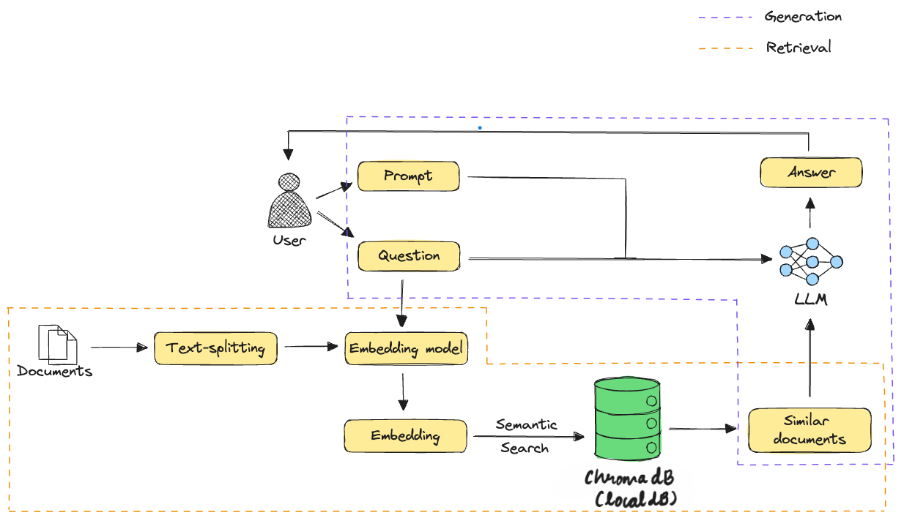

# Document Answering Application Using RAG

This project is a **Document Answering Application** that leverages **Retrieval-Augmented Generation (RAG)** to provide accurate answers to user queries based on the context of an uploaded document. The application is built with **Streamlit** and uses **ChromaDB** as its knowledge base for efficient retrieval and processing.

---

## What is RAG?

**Retrieval-Augmented Generation (RAG)** is an advanced NLP framework that combines the strengths of retrieval-based methods and generative language models:

- **Retrieval Module**: Identifies and retrieves the most relevant pieces of context from a knowledge base or document repository.
- **Generative Module**: Uses the retrieved context to generate accurate and context-aware answers.

This hybrid approach ensures high accuracy for in-context queries and robust handling of out-of-context queries.

### RAG Architecture

Below is an overview of the architecture used in this project:



---

## Features

- Upload PDF documents for dynamic question-answering.
- Real-time chat interface with a conversational feel and chat history.
- Handles both in-context (from the document) and out-of-context queries.
- Knowledge base powered by **ChromaDB** for fast and accurate retrieval.
- AI-powered by **Gemini Pro (Google Generative AI)** for natural and concise responses.

---

## Technology Stack

- **Python**: Core programming language.
- **Streamlit**: Framework for building an interactive user interface.
- **ChromaDB**: Knowledge base for document embedding storage and retrieval.
- **Google Generative AI**: Provides embeddings and answers using the Gemini Pro model.
- **LangChain**: Manages the document processing and retrieval-augmented answering pipeline.

---

## Installation

1. Clone the repository:
   ```bash
   git clone https://github.com/yourusername/document-answering-rag.git

2. Install the required dependencies:
   ```bash
   pip install -r requirements.txt

3. Run the application:
   ```bash
   streamlit run app2.py

## Usage
- Upload a PDF document to initialize the knowledge base.
- Type your queries into the chat interface.
- View answers based on the uploaded document or external reasoning.

## Screenshots

1. Questions Asked from the Document Context
   

2. Questions Asked Out of Context
   


## Knowledge Base
- This application uses **ChromaDB** as its backend for knowledge storage and retrieval. ChromaDB ensures efficient and scalable storage of document embeddings and allows for fast similarity searches, enabling the retrieval of the most relevant context for any query.

## Future Enhancements
- Add support for multiple file formats (e.g., Word, TXT).
- Extend the knowledge base to integrate external APIs for broader context.
- Optimize embeddings storage for larger-scale applications.
- Improve response quality for out-of-context questions using advanced reasoning.

## Contributing
- Contributions are welcome! Please fork the repository and submit a pull request with your changes.

## License
- This project is licensed under the MIT License. See the LICENSE file for details.

## Developed with ❤️ using RAG, ChromaDB, and Streamlit.


### Notes for Customization:
1. Replace placeholders with actual architecture diagrams and screenshots.
2. Update the repository URL, if applicable.
3. Include a `LICENSE` file if you want to distribute your project under a specific license.